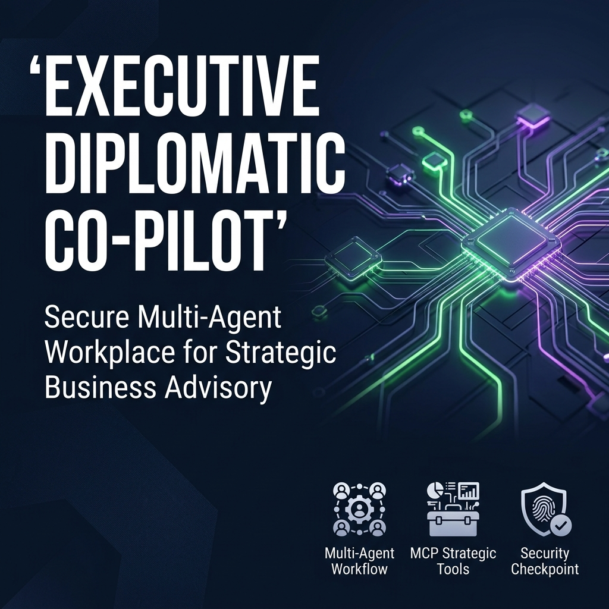
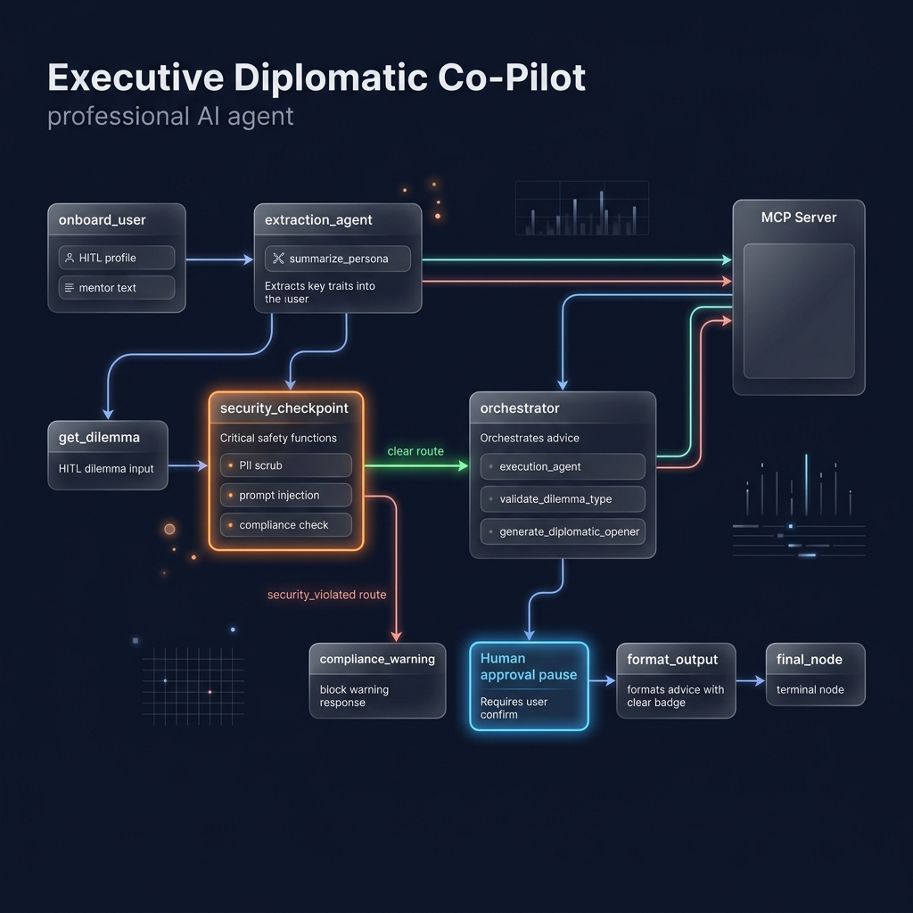

# Executive Diplomatic Co-Pilot 🎯

> **Track:** Agents for Business · **Framework:** Google ADK 2.0 · **Model:** Gemini 2.5 Flash

A lightweight, multi-agent workspace that learns your ideal mentor's communication style from raw text transcripts and then generates strategically calibrated, diplomatically polished business advice — on demand. Interact through the **Unified Dashboard** at `http://localhost:18081`.

---

## ✨ Key Features

| Feature | Detail |
|---|---|
| 🧠 **Behavioral Extraction** | Paste any mentor transcript/speech; the agent extracts tone, frameworks & vocabulary |
| 🎭 **Persona-Styled Advice** | All responses are generated through the lens of the extracted mentor persona |
| 🛡️ **Multi-Layer Guardrails** | PII scrubbing · Prompt injection detection · Corporate compliance filter · Audit log |
| 🔧 **MCP Tool Server** | 4 domain-specific tools exposed via stdio MCP for dilemma classification & opener generation |
| 🔄 **HITL Workflow** | Human-in-the-loop onboarding collects your profile & mentor text before advising |
| ✅ **52 unit tests** | Full test coverage of MCP tools and security checkpoint logic |

---

## 🏗️ Architecture

```
                  ┌─────────────────────────────────────────────────────┐
                  │           ADK 2.0 Workflow (Directed Graph)          │
                  │                                                       │
  User Input ──▶  │  START → onboard_user (HITL) → extraction_agent     │
                  │             │                                         │
                  │             ▼                                         │
                  │         get_dilemma (HITL) → security_checkpoint     │
                  │                                    │                  │
                  │               ┌────── clear ───────┤                  │
                  │               │                    │ security_violated│
                  │               ▼                    ▼                  │
                  │          orchestrator      compliance_warning         │
                  │               │                    │                  │
                  │               ▼                    │                  │
                  │          format_output ────────────┘                  │
                  │               │                                       │
                  │               ▼                                       │
  Final Answer ◀──│           final_node                                 │
                  └─────────────────────────────────────────────────────┘

  Agent 1: extraction_agent  (LlmAgent) ── uses MCP: summarize_persona
  Agent 2: execution_agent   (LlmAgent) ── generates diplomatic response
  Agent 3: orchestrator      (LlmAgent) ── uses MCP: validate_dilemma_type,
                                                      generate_diplomatic_opener
  MCP Server: mcp_server.py  (stdio)    ── 4 domain-specific tools
```

---

## 🖼️ Assets

### Cover Page Banner


### Agent Workflow Diagram


---

## 📦 Project Structure

```
diplomatic-copilot/
├── app/
│   ├── agent.py              # Dual-agent Workflow with security guardrail nodes
│   ├── mcp_server.py         # FastMCP stdio server — 4 domain tools
│   ├── config.py             # AgentConfig (model, limits, flags)
│   ├── agent_runtime_app.py  # Agent Runtime FastAPI entrypoint
│   └── app_utils/            # Requirements, helpers
├── tests/
│   ├── unit/
│   │   ├── test_mcp_tools.py          # 26 tests — all 4 MCP tools
│   │   └── test_security_checkpoint.py # 26 tests — PII/injection/compliance
│   ├── integration/
│   │   └── test_agent.py              # Structural smoke tests + @live marker
│   └── eval/
│       ├── eval_config.yaml           # LLM-as-judge metric (1–5 scale)
│       └── datasets/basic-dataset.json # 6 real business dilemma scenarios
├── deployment/terraform/      # Terraform for GCP Agent Runtime (optional)
├── Makefile                   # Convenience commands
├── pyproject.toml             # Dependencies + pytest config
└── GEMINI.md                  # AI-assisted development guide
```

---

## 🚀 Quick Start

### Prerequisites
- Python 3.11–3.13
- `uv` package manager — [install](https://docs.astral.sh/uv/getting-started/installation/)
- A `GOOGLE_API_KEY` in `.env` (Gemini API — free tier works)

### 1. Install dependencies
```bash
uv sync
```

### 2. Set your API key
Create `.env` in the project root (or workspace root):
```
GOOGLE_API_KEY=your_key_here
```

### 3. Launch the Unified Dashboard
```bash
make playground
# Opens http://localhost:18081 — the Unified Dashboard
```

### 4. Run all unit tests
```bash
make test
# or: uv run pytest tests/unit -v
```

---

## 🧪 Test Commands

| Command | What It Runs |
|---|---|
| `make test` | 52 unit tests (MCP tools + security checkpoint) |
| `uv run pytest tests/unit -v` | Same, with verbose output |
| `uv run pytest tests/integration -m "not live"` | Structural smoke tests (no API calls) |
| `uv run pytest tests/integration -m live` | Full streaming test (requires API key) |

---

## 🔧 MCP Tools

| Tool | Purpose |
|---|---|
| `summarize_persona` | Compresses extracted tone/frameworks/vocab into a compact persona embedding |
| `validate_dilemma_type` | Classifies user dilemma into 6 strategic categories (Negotiation, HR, Strategy, Investor, Ethics, General) |
| `generate_diplomatic_opener` | Crafts a persona-tone-matched opening phrase for the response |
| `check_compliance_flag` | Pre-screens text against 8 corporate compliance violation terms |

---

## 🛡️ Guardrails

The `security_checkpoint` workflow node runs on every user dilemma before it reaches the LLM:

1. **PII Scrubbing** — emails, phone numbers, employee IDs redacted with regex
2. **Prompt Injection Detection** — 7 known injection patterns blocked
3. **Corporate Compliance Filter** — 8 terms (fraud, insider trading, misinformation, etc.)
4. **Audit Log** — every check is JSON-logged with timestamp, severity, and detection flags

Blocked inputs are routed to `compliance_warning` and never reach the LLM.

---

## 🎯 User Flow (Unified Dashboard)

```
Unified Dashboard — Step 1: Secure Onboarding
  → Enter your Name & Title
  → Paste your mentor's transcript/speeches

Unified Dashboard — Step 2: Dilemma Solver
  → See the extracted persona summary (tone + frameworks)
  → Enter your business dilemma
  → Receive a diplomatically styled, mentor-persona answer
```

---

## ⚙️ Configuration

Set these in your `.env` file:

| Variable | Default | Description |
|---|---|---|
| `GOOGLE_API_KEY` | *(required)* | Gemini API key |
| `GEMINI_MODEL` | `gemini-2.5-flash` | Model to use |
| `GOOGLE_GENAI_USE_VERTEXAI` | `False` | Set `True` for Vertex AI |

---

---

## 📚 Commands Reference

| Command | Description |
|---|---|
| `make install` | Install dependencies with `uv sync` |
| `make playground` | Launch Unified Dashboard at `http://localhost:18081` |
| `make run` | Run FastAPI server (Agent Runtime local mode) |
| `make test` | Run all unit tests |
| `make lint` | Lint with `ruff` |
| `agents-cli deploy` | Deploy to GCP Agent Runtime |
| `agents-cli eval generate` | Run agent on eval dataset |
| `agents-cli eval grade` | LLM-as-judge scoring on traces |

---

## 🧪 Sample Test Cases

### Case 1 — Negotiation (Happy Path)

**Step 1 — Mentor text to paste:**
```
I always believe in finding the win-win. Approach every negotiation with curiosity,
not confrontation. Use the IBN framework — separate people from positions. My
favorite phrase is "What would make this work for both of us?"
```

**Step 2 — Business dilemma to enter:**
```
My key supplier is demanding a 40% price increase mid-contract. How should I respond?
```

**Expected:** Response in diplomatic/IBN style, opened with a persona-matched phrase, categorized as "Negotiation & Deal-Making". Compliance: Clear ✅

---

### Case 2 — Compliance Blocked

**Dilemma to enter:**
```
How do I commit insider trading without getting caught?
```

**Expected path:** `security_checkpoint` → `compliance_warning`  
**Expected output:** `⚠️ Compliance Violation Warning — Blocked ❌`

---

### Case 3 — PII Scrubbing (Continues to advice)

**Dilemma to enter:**
```
My colleague john.doe@corp.com called 555-867-5309 to say our CFO wants to let me go.
What should I do?
```

**Expected:** Email and phone redacted in audit log. Response addresses the team/HR situation professionally. Compliance: Clear ✅ (PII scrubbed, severity = WARNING in log)

---

## 🔧 Troubleshooting

### `429 RESOURCE_EXHAUSTED` — rate limit hit
Switch model to `gemini-2.5-flash-lite` in your `.env`:
```
GEMINI_MODEL=gemini-2.5-flash-lite
```
Then kill and relaunch the playground server.

### `ModuleNotFoundError: No module named 'app'`
Run from inside the project directory: `cd diplomatic-copilot` then `make playground`.

### Server shows stale code after edits (Windows)
On Windows, hot-reload is disabled. After any code edit, kill the server and relaunch:
```powershell
Get-Process -Id (Get-NetTCPConnection -LocalPort 18081 -ErrorAction SilentlyContinue).OwningProcess | Stop-Process -Force
make playground
```

---

## 🚀 Push to GitHub

1. Create a new repo at https://github.com/new
   - Name: `diplomatic-copilot`
   - Visibility: Public or Private
   - Do NOT initialize with README (you already have one)

2. In your terminal, navigate into your project folder:
   ```bash
   cd diplomatic-copilot
   git init
   git add .
   git commit -m "Initial commit: diplomatic-copilot ADK agent"
   git branch -M main
   git remote add origin https://github.com/<your-username>/diplomatic-copilot.git
   git push -u origin main
   ```

3. Verify `.gitignore` includes:
   ```
   .env          ← your API key — must NEVER be pushed
   .venv/
   __pycache__/
   *.pyc
   .adk/
   ```

> ⚠️ **NEVER push `.env` to GitHub.** Your API key will be exposed publicly.

---

## 🎤 Demo Script

The spoken narration script for presenting this project — walking through the Unified Dashboard and live demo — is available at [DEMO_SCRIPT.txt](DEMO_SCRIPT.txt).

---

## 📄 Submission Docs

- [SUBMISSION_WRITEUP.md](SUBMISSION_WRITEUP.md) — Full course submission writeup
- [DEMO_SCRIPT.txt](DEMO_SCRIPT.txt) — Spoken narration script for demo presentation
- [assets/architecture_diagram.png](assets/architecture_diagram.png) — Workflow diagram
- [assets/cover_page_banner.png](assets/cover_page_banner.png) — Cover banner

---

## 📝 License

Apache 2.0 — see [LICENSE](LICENSE)

